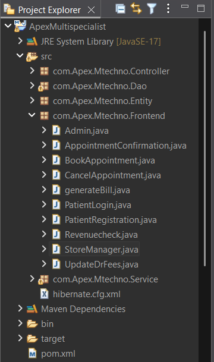

# Hospital Management System (Backend - Hibernate Based)

## Overview

This project is a backend-based Hospital Management System developed using Core Java and Hibernate ORM.  
It manages core hospital operations such as patient registration, doctor management, appointment booking, billing, inventory tracking, and revenue monitoring using MySQL.

The focus of this project is on backend architecture, layered design, and database handling without using any frontend framework or REST APIs.

---

## Technology Stack

- Java (Core + OOP Concepts)
- Hibernate ORM
- MySQL
- Maven
- JDBC
- Java Mail API (for appointment confirmation)

---

## Project Structure

The project follows a layered architecture to maintain separation of concerns:

- Controller Layer – Handles user interactions
- Service Layer – Contains business logic
- DAO Layer – Database operations using Hibernate
- Entity Layer – Hibernate entity mappings
- Console Module – User interaction through command line
- Configuration – hibernate.cfg.xml

---

## Features

- Patient Registration and Login
- Doctor Management
- Appointment Booking and Cancellation
- Automatic Appointment ID Generation
- Email Confirmation after Appointment Booking
- Billing Generation with GST calculation
- Medicine Inventory Management
- Low Stock and Expiry Detection
- Hospital Revenue Tracking

---

## Database Tables

- patient  
- doctor  
- appointment  
- billgeneration  
- medicineinventory  
- hospitalrevenue  
- doctorfeesaudit  
- paymentcd  
- login  
- hibernate_sequence  

---

## Key Implementation Details

- Stock status detection (Low Stock / Out of Stock / Expired)
- Expiry flag management for medicines
- Primary key generation using Hibernate sequence
- Clear separation of responsibilities using layered design

---

## How to Run

1. Clone the repository
2. Create a MySQL database (e.g., `apexhospital`)
3. Update database credentials in `hibernate.cfg.xml`
4. Build the project using Maven
5. Run the main classes from the console module(frontend packege) by following sequence

  -- sequence...
1. add a doctor by admin 
2. do resistration of patient
3. book appointment with valid credentials and got the appointment id on registered email
4. add medicine stock or remove after sell by storemanager in inventory
---

## Screenshots

### Project Structure

### Database Tables

### Appointment Booking Output

---

## Future Improvements

- Implement entity relationships using @OneToMany and @ManyToOne
- Convert to REST API using Spring Boot
- Add authentication and role-based access
- Develop frontend (React / JSP)

---

## Developer

Developed as a backend-focused academic project to strengthen understanding of Hibernate ORM, database integration, and layered architecture design.
